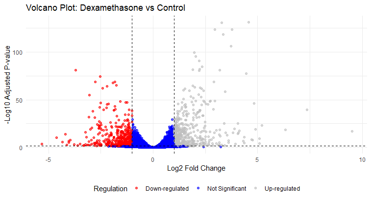
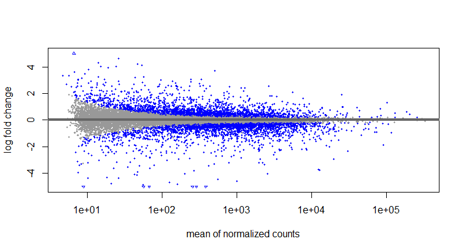
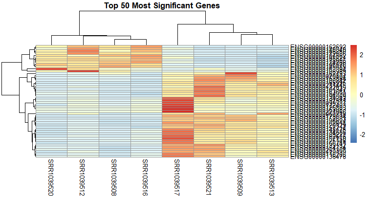

# 🧬 Airway RNA-seq Analysis: Dexamethasone Treatment in Human Airway Cells

[](https://www.r-project.org/)
[](https://bioconductor.org/packages/release/bioc/html/DESeq2.html)
[](https://opensource.org/licenses/MIT)

## 📌 Overview

This project analyzes RNA-seq data from human airway smooth muscle cells treated with **dexamethasone** – a common anti-inflammatory drug used to treat asthma.

**Key Question:** How does dexamethasone change gene expression patterns in airway cells?

## 🔬 Experimental Design

| Factor | Details |
|--------|---------|
| **Samples** | 8 total (4 treated, 4 untreated) |
| **Treatment** | Dexamethasone (1 μM, 18 hours) |
| **Cell Type** | Human airway smooth muscle cells |
| **Donors** | 4 different individuals |
| **Sequencing** | Illumina HiSeq 2000 |

## 📊 Results Summary

- **Total genes analyzed:** ~20,000
- **Significantly DE genes (padj < 0.05, |log2FC| > 1):** 1138 genes

### Top 10 Most Significant Genes

| Gene Symbol | Log2FC | Adj. P-value | Regulation |
|-------------|--------|--------------|------------|
| SPARCL1 | 4.57 | 3.58e-132 | Up ⬆️ |
| CACNB2 | 3.29 | 8.60e-132 | Up ⬆️ |
| DUSP1 | 2.95 | 1.22e-124 | Up ⬆️ |
| SAMHD1 | 3.76 | 1.88e-124 | Up ⬆️ |
| MAOA | 3.35 | 2.57e-119 | Up ⬆️ |
| GPX3 | 3.73 | 5.98e-107 | Up ⬆️ |
| STEAP2 | 1.97 | 1.96e-100 | Up ⬆️ |
| NEXN | 2.03 | 2.17e-96 | Up ⬆️ |
| MT2A | 2.21 | 1.50e-91 | Up ⬆️ |
| ADAMTS1 | 2.34 | 2.45e-85 | Up ⬆️ |

## 📈 Visualizations

### Volcano Plot


### MA Plot


### Top 50 Genes Heatmap


🛠️ Methods

| Parameter | Value |
|-----------|-------|
| Significance cutoff (padj) | < 0.05 |
| Fold change cutoff (log2FC) | > \|1\| |
| Multiple testing correction | Benjamini-Hochberg (FDR) |

📁 Repository Contents

- `airway_deseq2_analysis.RData` - Complete R workspace
- `significant_genes.csv` - All significant genes
- `significant_genes.xlsx` - Excel version
- `volcano_plot.png` - Volcano plot
- `heatmap.png` - Top 50 genes heatmap
- `ma_plot.png` - MA plot

🚀 How to Reproduce

```r
# Load workspace
load("airway_deseq2_analysis.RData")
head(sig_genes[, c("symbol", "log2FoldChange", "padj")])
table(sig_genes$log2FoldChange > 0)

📚 Citation

Dataset: Himes, B.E., et al. (2014). *Scientific Data* 1, 140031.

Methods: Love, M.I., Huber, W., Anders, S. (2014). *Genome Biology* 15(12), 550.

📞 Contact

Email:biotechcatalyst.info@gmail.com

📜 License

MIT License


Last updated: May 2026

